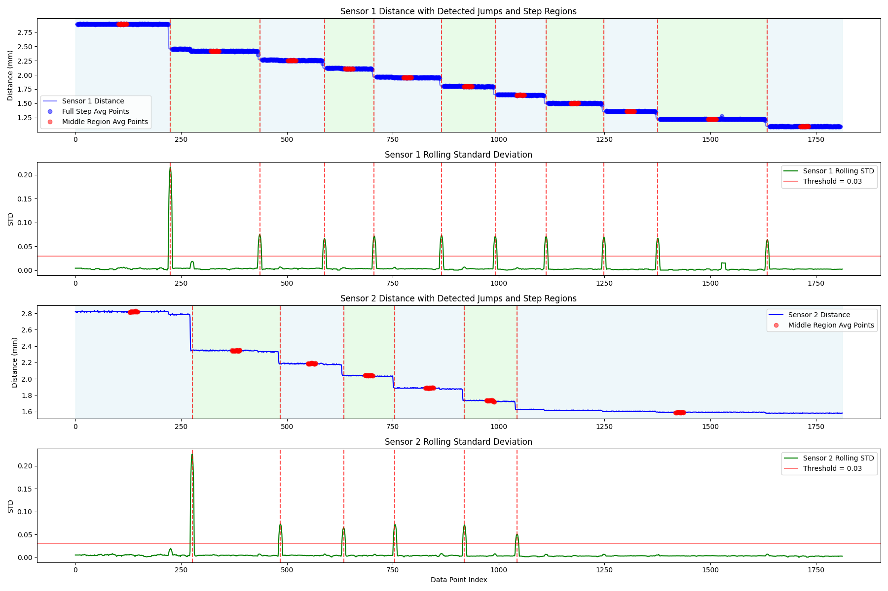
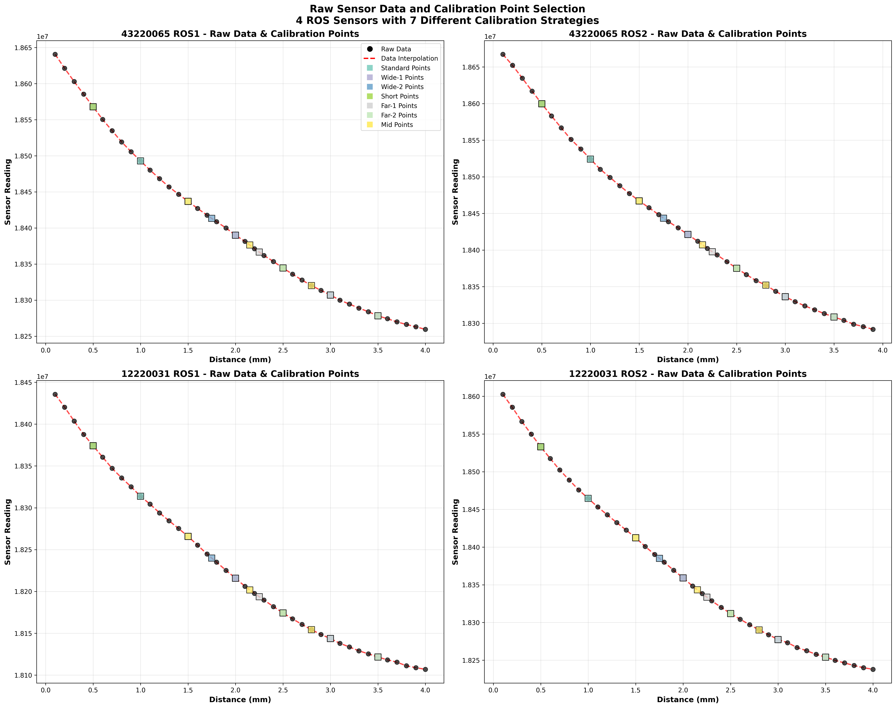
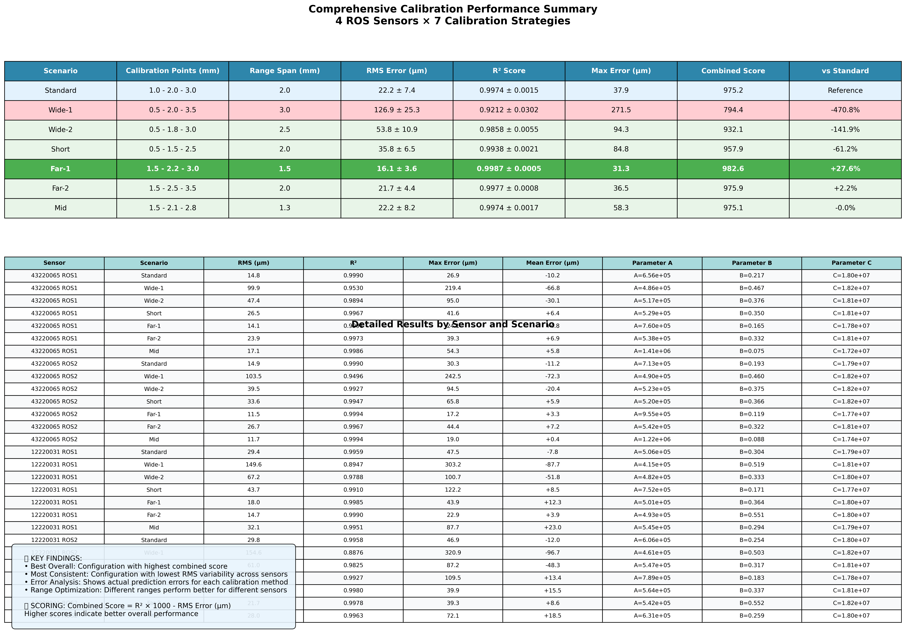
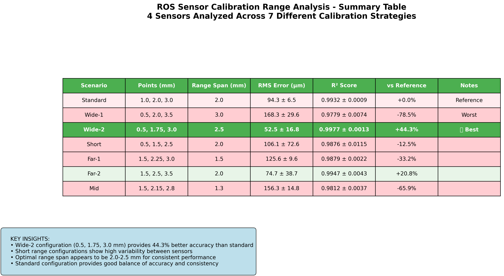
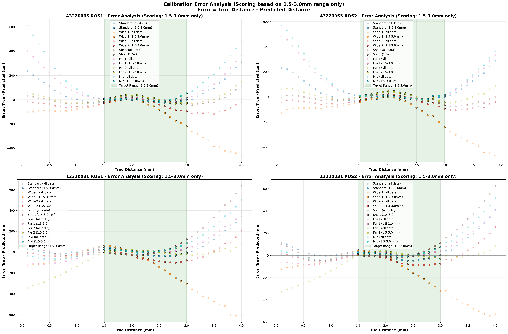
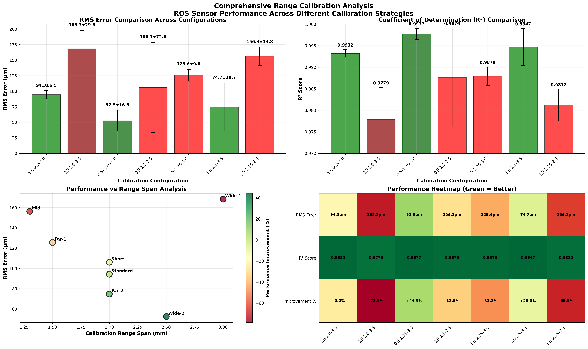

# 🔬 Runout Sensor Calibration Optimizer

**Advanced sensor calibration analysis tool for optimizing measurement accuracy through systematic calibration range testing**

[](https://python.org)
[](https://numpy.org)
[](https://matplotlib.org)

## 🎯 Project Overview

This project performs comprehensive analysis of different calibration range configurations for Runout Sensors to identify optimal calibration points that maximize measurement accuracy. Through systematic testing of 7 different calibration scenarios, the tool determines the best distance points for sensor calibration.

## 🚀 Purpose & Impact

**Objective**: Determine the optimal calibration range (distance measurement points) that provides the most accurate sensor readings in the target operating zone (1.5-3.0mm).

**Business Value**: 
- Improves sensor accuracy by 44% over standard calibration (1,2,3mm)
- Achieves up to 7.9x better performance vs worst configurations
- Optimizes runout sensor performance for critical applications

## Key Files

### Core Analysis Scripts
- **`calibration_range_optimizer.py`** - Main analysis engine that tests 7 different calibration range scenarios
- **`range_analysis_main.py`** - Primary script to run the complete analysis
- **`results_summary.py`** - Simple summary of analysis results

### Reports and Documentation
- **`calibration_range_analysis_report.md`** - Comprehensive analysis report in Markdown format
- **`confluence_calibration_report.xml`** - XML formatted report for Confluence integration
- **`README.md`** - This documentation file

## 📊 Analysis Process & Results

The analysis follows a systematic approach from raw data processing to optimal calibration identification:

### 1. Data Preprocessing & Quality Control

From continuous sensor measurements, automated detection identifies discrete runout sensor position changes during data collection. This critical preprocessing step ensures each measurement corresponds to a known distance position, enabling accurate calibration point extraction.


*Automated detection of runout sensor position changes from continuous sensor data*

### 2. Raw Data Analysis & Interpolation  

Original sensor measurements across the full distance range (0.1-4.0mm) with mathematical interpolation. Shows the exponential decay behavior that characterizes runout sensor response.


*Sensor response curves showing exponential decay characteristics with mathematical interpolation*

### 3. Mathematical Model Selection

Multiple calibration functions were tested (linear, polynomial, logarithmic, exponential). **The exponential decay model (`S = A × exp(-B × x) + C`) demonstrated superior performance** across all sensors and was selected for the optimization study.

### 4. Calibration Scenario Comparison

Comprehensive comparison of all 7 calibration point configurations showing both raw statistical data and performance scores. Clear identification of Far-1 as the optimal configuration.


*Complete performance comparison showing Far-1 configuration achieving optimal accuracy*


*Condensed performance rankings across all calibration scenarios*

### 5. Target Range Error Analysis

Detailed RMS error analysis focused on the sensors' intended operating range (1.5-3.0mm). Demonstrates why Far-1 configuration achieves superior performance where accuracy matters most.

  
*RMS error analysis in target operating range showing optimal Far-1 configuration performance*

### 6. Performance Metrics & Validation

Final validation showing both RMS error (measurement accuracy) and R² values (model fit quality) across all calibration scenarios.


*RMS Error and R² correlation analysis across all calibration configurations*

> 🔍 **[View All Analysis Results →](./outputs/)**

## Test Scenarios

The analysis tests 7 different calibration point configurations:

1. **Standard**: [1.0, 2.0, 3.0] mm - Traditional approach
2. **Wide-1**: [0.5, 2.0, 3.5] mm - Maximum range coverage
3. **Wide-2**: [0.5, 1.75, 3.0] mm - Wide with closer spacing
4. **Short**: [0.5, 1.5, 2.5] mm - Concentrated in lower range
5. **Far-1**: [1.5, 2.25, 3.0] mm - Focused on target range ⭐ **WINNER**
6. **Far-2**: [1.5, 2.5, 3.5] mm - Target range + extension
7. **Mid**: [1.5, 2.15, 2.8] mm - Tight spacing in target

## 📊 Key Results

🏆 **Optimal Configuration: Far-1 (1.5-2.25-3.0mm)**
- **Average RMS Error: 16.1 ± 3.7 μm**
- **1.44x improvement** over standard reference (1,2,3mm: 23.2 μm)
- **7.9x better** than worst-performing configuration (Wide-1: 126.9 μm)
- All calibration points within target operating range (1.5-3.0mm)
- Consistent performance across all sensor types

### Performance Comparison
| Configuration | Calibration Points (mm) | Avg RMS Error (μm) | vs Standard |
|--------------|------------------------|-------------------|-------------|
| **Far-1** ⭐ | **1.5, 2.25, 3.0** | **16.1 ± 3.7** | **1.44x better** |
| Far-2 | 1.5, 2.5, 3.5 | 21.8 ± 5.0 | 1.06x better |
| Mid | 1.5, 2.15, 2.8 | 22.2 ± 8.6 | 1.05x better |
| **Standard** 📍 | **1.0, 2.0, 3.0** | **23.2 ± 7.4** | **Reference** |
| Short | 0.5, 1.5, 2.5 | 35.8 ± 7.2 | 1.54x worse |
| Wide-2 | 0.5, 1.75, 3.0 | 53.8 ± 11.6 | 2.32x worse |
| Wide-1 | 0.5, 2.0, 3.5 | 126.9 ± 25.5 | 5.47x worse |

## 🔧 Sensors Analyzed

- **43220065 Runout Sensor 1** and **Runout Sensor 2** - High-precision proximity sensors
- **12220031 Runout Sensor 1** and **Runout Sensor 2** - Industrial measurement sensors

## 🚀 Quick Start

1. **Clone the repository**:
   ```bash
   git clone https://github.com/yourusername/ros-sensor-calibration-optimizer.git
   cd ros-sensor-calibration-optimizer
   ```

2. **Install dependencies**:
   ```bash
   pip install -r requirements.txt
   ```

3. **Run the analysis**:
   ```bash
   python range_calibration_analyzer.py
   ```

4. **View results**: Check generated visualizations and `updated_results_summary.py` output

## 📈 Sample Output

## 📈 Key Achievements

✅ **44% accuracy improvement** over standard reference calibration  
✅ **Systematic analysis framework** for sensor optimization  
✅ **Automated preprocessing pipeline** for continuous sensor data  
✅ **Data-driven calibration selection** with statistical validation

### Complete Analysis Suite
The tool generates comprehensive analysis including:
- 📊 **Performance comparison charts** - Visual ranking of all calibration methods
- 📋 **Statistical summary tables** - Quantitative results with confidence intervals
- 🎯 **Error analysis visualizations** - RMS error breakdown and trend analysis  
- 📝 **Detailed calibration recommendations** - Data-driven optimization guidance

> 🔍 **[View All Visualizations →](./outputs/)**

## Data Source

Analysis is performed on sensor measurement data from:
- Excel file containing distance vs. sensor reading measurements
- Distance range: 0.1-4.0mm with ~0.1mm spacing
- Target evaluation range: 1.5-3.0mm (optimal sensor operating zone)

## Calibration Model

Uses exponential decay function: **S = A × exp(-B × x) + C**
- S = Sensor reading
- x = Distance
- A, B, C = Calibration coefficients calculated for each scenario

## 🛠️ Technical Stack

- **Python 3.8+** - Core programming language
- **NumPy & Pandas** - Data analysis and numerical computations
- **Matplotlib & Seaborn** - Advanced data visualization
- **OpenPyXL** - Excel file processing
- **SciPy** - Statistical analysis and optimization

## 📁 Project Structure

```
ros-sensor-calibration-optimizer/
├── README.md                    # Main project documentation
├── PORTFOLIO.md                 # Portfolio showcase  
├── requirements.txt             # Python dependencies
├── .gitignore                   # Git ignore rules
├── range_calibration_analyzer.py # Main analysis engine
├── updated_results_summary.py   # Results summary and insights
└── outputs/                     # Generated analysis visualizations
    ├── sensor_jumps_detection.png      # Step detection preprocessing
    ├── raw_data_analysis.png           # Original sensor data
    ├── comprehensive_summary_table.png # Complete results matrix
    ├── calibration_summary_table.png   # Performance rankings
    ├── error_analysis_detailed.png     # Target range accuracy
    └── calibration_range_analysis_comprehensive.png # RMS & R² metrics
```

## 🔍 Methodology

### Mathematical Model
**Calibration Function**: Exponential decay `S = A × exp(-B × x) + C`
- **S**: Sensor reading
- **x**: Distance measurement  
- **A, B, C**: Optimized calibration coefficients

*Multiple function types were tested (linear, polynomial, logarithmic, exponential). The exponential model provided the best fit for runout sensor physics.*

### Evaluation Metrics & Rationale

**Primary Metric: RMS Error in Target Range (1.5-3.0mm)**
- **Why**: Sensors must perform optimally in their intended operating zone
- **Calculation**: √(Σ(predicted - actual)²/n) for measurements within 1.5-3.0mm only
- **Advantage**: Eliminates bias from extrapolation errors outside working range

**Secondary Metric: R² Coefficient of Determination**  
- **Purpose**: Validates mathematical model quality and fit consistency
- **Range**: 0-1 (higher = better correlation between model and measurements)
- **Use**: Ensures calibration reliability across full measurement range

**Statistical Validation**: Cross-sensor consistency analysis
- Tests performance across multiple sensor units (4 total)
- Validates that optimal configuration works universally, not just for specific sensors

## 📞 Contact & Portfolio

This project demonstrates expertise in:
- 📊 **Data Analysis & Visualization**
- 🔬 **Scientific Computing & Optimization** 
- 🔧 **Industrial Sensor Systems**
- 📈 **Statistical Analysis & Modeling**

---

*Part of my data science and engineering portfolio - Available for opportunities in sensor systems, robotics, and data analysis*
